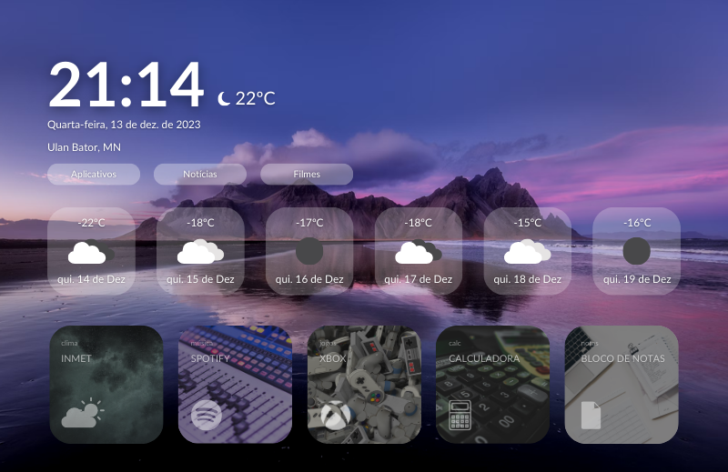

# MultiHub com a API OpenWeatherMap

O MultiHub é um projeto que combina funcionalidades de uma página inicial interativa, login com senha, informações de clima usando a API Open Weather Map, seção de filmes e notícias, proporcionando uma experiência multifuncional.

## Demo

Confira a [Demo do MultiHub](https://codepen.io/La-s-Lara/pen/vYbwBVj?editors=1010) para ver o projeto em ação.

## Conteúdo

1. [Visão Geral](#visão-geral)
2. [Tecnologias Utilizadas](#tecnologias-utilizadas)
3. [Instalação](#instalação)
4. [Como Usar](#como-usar)
5. [Funcionalidades](#funcionalidades)
6. [Contribuição](#contribuição)
7. [Licença](#licença)

## Visão Geral

O MultiHub é uma aplicação web que oferece uma experiência de usuário única, combinando várias funcionalidades em uma única página. Desde uma tela inicial interativa até seções dedicadas para informações climáticas, filmes e notícias, o MultiHub busca simplificar o acesso a diversas informações.

## Tecnologias Utilizadas

- HTML
- CSS
- JavaScript
- API OpenWeatherMap: Utilizada para obter informações climáticas com base na localização do usuário.

## Instalação

1. Clone o repositório: `git clone URL_DO_REPOSITORIO`
2. Abra o arquivo `index.html` em um navegador web.

## Como Usar

Após a instalação, abra o arquivo `index.html` em um navegador web compatível. Explore as diferentes seções clicando nos links da barra de navegação ou utilizando a barra de rolagem horizontal na seção de filmes.

## Funcionalidades

### Tela Inicial
- Página inicial interativa com transições suaves.

### Login com Senha
- Digite a senha correta (`1234`) para acessar o conteúdo exclusivo.

### Informações Climáticas
- Utiliza a API OpenWeatherMap para obter informações climáticas baseadas na localização do usuário.
- Exibe a previsão do tempo para os próximos dias.

### Seção de Filmes
- Apresenta uma lista de filmes com rolagem horizontal.
- Deslize horizontalmente para visualizar mais filmes.

### Seção de Notícias
- Apresenta notícias com imagens em um layout atraente.
- Clique em "Leia Mais" para obter detalhes adicionais.

## Contribuição

Se deseja contribuir com o projeto, siga estas etapas:
1. Faça um fork do projeto.
2. Crie uma branch para sua contribuição (`git checkout -b feature/AmazingFeature`).
3. Faça commit das mudanças (`git commit -m 'Adiciona uma funcionalidade incrível'`).
4. Faça um push para a branch (`git push origin feature/AmazingFeature`).
5. Abra um pull request.

## Licença

Este projeto está licenciado sob a Licença [MIT](LICENSE). Veja o arquivo [LICENSE](LICENSE) para mais detalhes.
